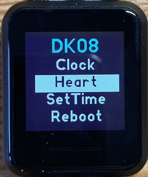

# DK08 Espruino - Execution Environment and Apps

The repository contains a set of Espruino Apps for the Dk08 Smartwatch together with drivers to support these Apps. The DK08 has a sunlight readable always on display but is controlled by a single touch button which limits the applications that are practical to run on it.

## Installation

For a brand-new DK08, you need to follow the instructions [here](https://github.com/fanoush/ds-d6/tree/master/espruino/DFU/DK08) produced by @fanoush to install Espruino and an SDK11 bootloader. 

The next step is to upgrade to SDK12 using [`DK08-sdk11-to-sdk12.zip`](https://github.com/fanoush/ds-d6/blob/master/espruino/DFU/DK08/DK08-sdk11-to-sdk12.zip).

Finally you can flash this firmware:

[`espruino_2v08_DK08_SDK12_MOD.zip`](https://github.com/jeffmer/DK08Apps/blob/master/firmware/espruino_2v08_DK08_SDK12_MOD.zip)

This build has a modified `bluetooth` module to support the ANCS widget that connects to iPhones.

Once Espruino is installed use the [DK08 App Loader](https://jeffmer.github.io/DK08Apps/) to load `Main` and `Clock` and the apps (only app is ***Heart*** and the widgets you want.

### Controls

Single touch moves between menu items and turns on the backlight for 5 sceonds.

Double touch moves between clock faces

To change Apps, a long touch on the touch screen will redisplay the startup menu (see picture above).
 
### Warning

There is a distinct possibility of "bricking" your Dk08. 

To mitigate this risk, `main.js` sets a watchdog timer and if you press the button and hold it for over 20 seconds, the Dk08 should reboot. If there is no response, let the battery go flat - may take some time - and the DK08 should restart when you connect the charger. 

### Credits

@Fanoush, the hard work here is all due to `fanoush` who "cracked" the DK08 and discovered the details of all the devices. In addition, he developed the `st7301` display driver included in this repository. 

@gfwilliams, for [Espruino](https://www.espruino.com/) and for the Espruino App Loader used here. *If you want a hassle free watch you can program off the shelf get a Bangle.js.*

